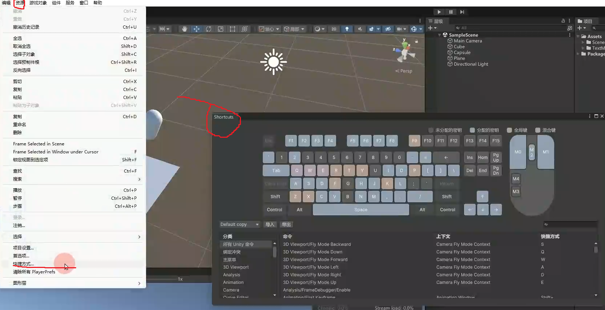
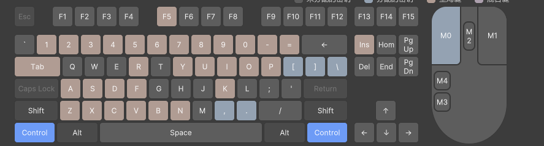

# 快捷键介绍

提高生产力的东西. 让开发更爽.

## 全局命令,上下文命令

还好我学习过 C++ namespace 和 数据结构的树.  
全局命令: namespace :: { ... }  
上下文命令: ::3D_Viewport { ... }
就是这样.

## 冲突

namespace :: { 快捷键A(ctrl + c); 快捷键B(ctrl + c); }  
两个快捷键是同一个 ctrl + c.

## 命令类型

* 按下触发一次
* 按下(触发)+松开(触发).触发两次
* 激活主菜单选项(不懂).

# 快捷键窗口

  

okk. 我相信我看懂了吧好吧.

  

你看了上面的 全局命令,上下文命令 应该就知道了这是何意味.  
::control { tab; A; Z }  
或是树  
:: ==>(+) control ==>(+) tab;

# [食用](../resources/快捷键食用.mp4)
